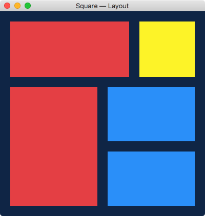

# Arc
> Native UI toolkit for creating cross-platform graphical user interfaces in Rust.

 * Only supports macOS currently. Support is planned for Windows next and then Linux when time allows.
 * Uses [Yoga](https://yogalayout.com/) which is an implementation of [Flexbox](https://www.w3.org/TR/css-flexbox-1/) to measure and layout components.

## Status

Don't use.

## License

Licensed under either of

 * Apache License, Version 2.0
   ([LICENSE-APACHE](LICENSE-APACHE) or http://www.apache.org/licenses/LICENSE-2.0)
 * MIT license
   ([LICENSE-MIT](LICENSE-MIT) or http://opensource.org/licenses/MIT)

at your option.

## Contribution

Unless you explicitly state otherwise, any contribution intentionally submitted
for inclusion in the work by you, as defined in the Apache-2.0 license, shall be
dual licensed as above, without any additional terms or conditions.
